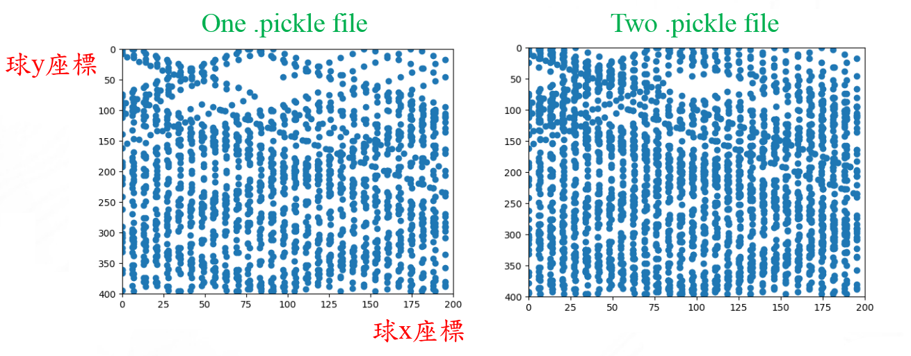
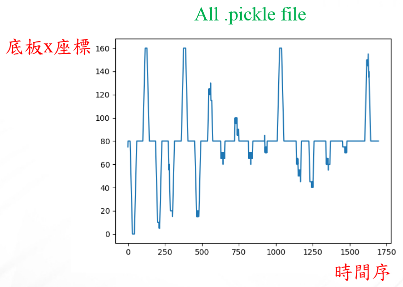
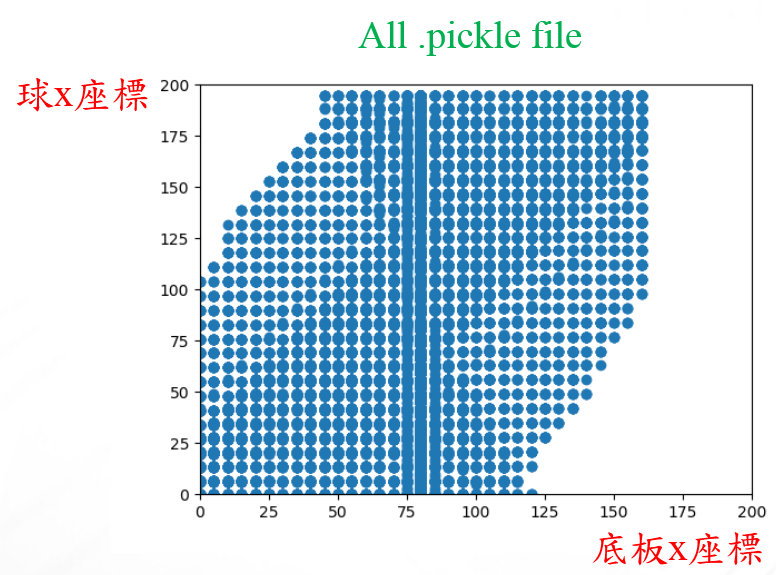
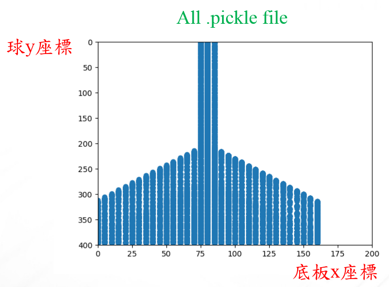

# 需求
 1. 球不漏接(打完三關)
 2. 發球點為隨機亂數
 3. 減輕電腦運算效能

# 分析
 - Input
	 - 目前球座標
	 - 前一點球座標
	 - 底板座標
 - Output
	 - 底板移動方向
 - Parameter
	 - FPS

# 設計
 - 為了達到在發球點為隨機亂數時不漏接球，需要大量成功紀錄檔，所以在需要將發球位置加入random(X座標和Y座標為5 ~ 195 pixel)，並且在訓練knn時，將紀錄檔整理出成功的紀錄檔並放入指定資料夾提供knn訓練
 - 為了降低運算負擔，在寫rule base時加入球只在落下且Y座標需要大於200pixel(遊戲介面為200*500)才開始進行運算
 - 為了降低來不及接球的情況，每次打完球將底板回歸中心點
 
## 定義變數
|變數名稱          |資料形態|用途                                 |  
|------------------|-----  |-------------------------------------|
|mode              |string |使用rulebase或訓練結果                |
|predictFunction   |string |使用何種訓練方式(knn、svm)             |
|now_ball_position |int[]  |目前球座標                            |
|past_ball_position|int[]  |前一點球座標                          |
|ball_down         |boolean|球是否落下                            |
|move              |int    |底板移動方向(1為右移，-1為左移，0為不動)|

## 流程圖

## 資料視覺化

# 組員
 - F108112103 李昱興
 - F108112105 王思涵
